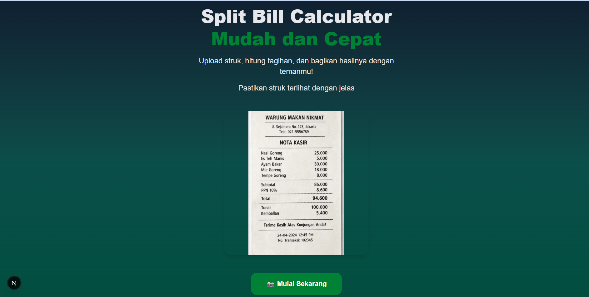
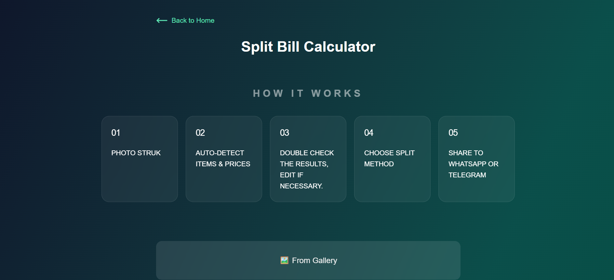
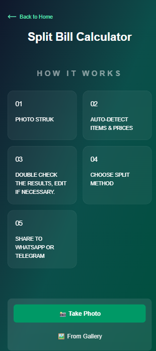

## Split Bill Calculator

Split Bill Calculator is a web application designed to simplify the process of splitting bills. Users simply take a photo of a food or shopping receipt, and the app will automatically extract a list of items and prices using OCR (Optical Character Recognition) technology and Gemini AI. Users can also edit or add items if the OCR result doesn't match the photographed receipt.

## Tech Stack Used

Framework: Next.js 16
Language: TypeScript
Styling: Tailwind CSS
OCR Engine: Tesseract.js
AI: Gemini AI

## Setup instructions

```bash
npx create-next-app@latest split-bill-calculator

cd split-bill-calculator

code .

npm install
```

## Getting Started

First, run the development server:

```bash
npm run dev
# or
yarn dev
# or
pnpm dev
# or
bun dev
```

**Live Demo:**  
https://split-bill-calculator-7ctk.vercel.app/




